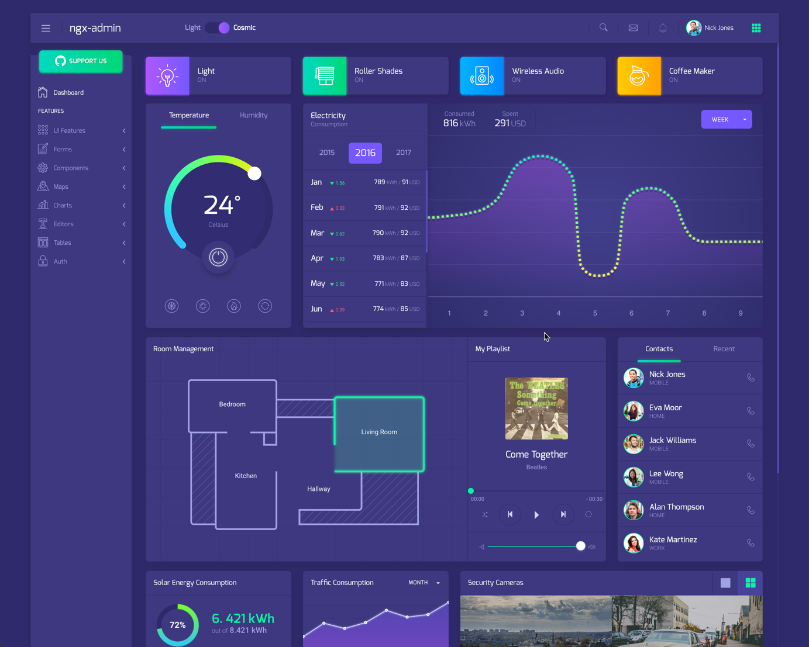

# Acknowledgement
This app is adapted so that it can be deployed to on prem and off prem cloud foundry, please read [akveo](about-akveo.md) license of use.

# clone this project
```
git clone git@github.com:ibmcloudprivate2/ng4-admin.git
```

# build the project
```
npm install
npm run-script build
```

# build the image
```
docker build . -t ngx-admin
```

# test docker locally
```
docker run -p 3000:3000 ngx-admin
```

# login to ICP private repo
```
docker login prd.icp:8500
```

# push docker image
```
docker tag ngx-admin prd.icp:8500/dev/ngx-admin:1.0
docker push prd.icp:8500/dev/ngx-admin:1.0
```

# Deploy the image
Refer to [deploy custom image](https://github.ibm.com/icp-ap/Learning/blob/master/demo-with-ipad.md#demo-2-custom-docker-image)

General Tab

name | value
-----| -----
Name | js-ngx-admin

Container settings Tab

name | value
-----| -----
Name | js-ngx-admin
Image | prd.icp:8500/dev/ngx-admin:1.0
Image Pull Secrets | registry-secret
Container port | 3000

*note:* v2.1.0.1 requires the setup of image pull secrets for a namespace

# Expose the deployment with Service

General Tab

name | value
-----| -----
Name | js-ngx-admin-service
Type | NodePort

Ports Tab

name | value
-----| -----
TCP | http, 3000, 3000

Selectors Tab

name | value
-----| -----
app | js-ngx-admin

# Access the application


